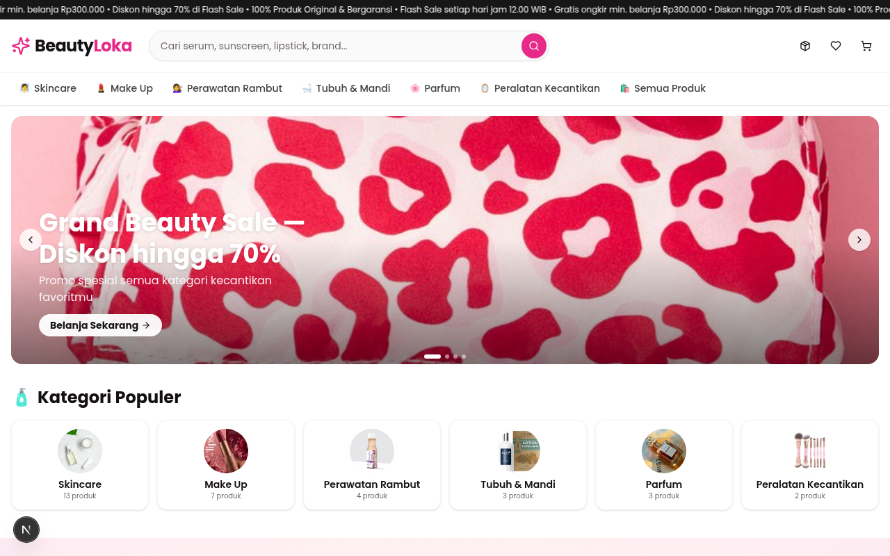
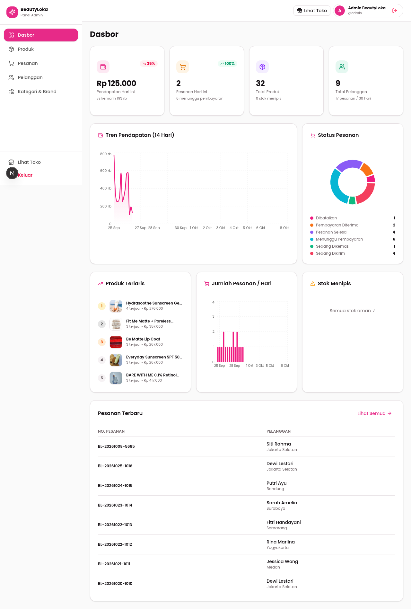

# 💄 BeautyLoka — Webstore & Admin Dashboard

**BeautyLoka** adalah aplikasi e-commerce kecantikan full-stack terinspirasi [Sociolla](https://www.sociolla.com/), terdiri dari **storefront pelanggan** dan **admin dashboard** dalam satu aplikasi.

Dibuat **100% dinamis**: seluruh konten — produk, harga & promo, voucher, jendela flash sale, ongkir, metode pembayaran, teks promosi, artikel, hingga footer — disimpan di database (**PostgreSQL**, rekomendasi gratis: [Neon](https://neon.tech)) dan dapat diubah dari dashboard admin **tanpa menyentuh source code sama sekali**.



## ✨ Fitur Utama

### 🛍️ Storefront (Toko Online)
- **Beranda dinamis** — hero banner carousel, marquee promo, grid kategori, flash sale + countdown, brand populer, rekomendasi produk, dan artikel; semuanya dibaca dari database.
- **Katalog produk** — filter per kategori & brand, pencarian, pengurutan (terbaru, termurah, termahal, terlaris), halaman khusus flash sale.
- **Detail produk** — galeri, tab deskripsi/kegunaan, ulasan & rating, pengaturan jumlah, produk terkait.
- **Keranjang** — minimum pembelian, info ongkir, dan info voucher berlaku.
- **Checkout 4 langkah** — data diri → pengiriman (dari DB) → pembayaran + biaya layanan (dari DB) → ringkasan; validasi voucher secara real-time.
- **Halaman sukses** — instruksi pembayaran otomatis sesuai metode yang dipilih (dari DB).
- **Lacak pesanan** berdasarkan kode pemesanan.
- Responsive mobile-first (grid 2 kolom di layar kecil).



### 📊 Admin Dashboard
- **Login aman** — token sesi HMAC-SHA256, semua endpoint admin terproteksi `Authorization: Bearer <token>`.
- **Ringkasan** — 4 kartu statistik, grafik area/pie/bar (Recharts), produk terlaris, stok menipis, pesanan terbaru.
- **Katalog** — CRUD produk (harga normal + harga promo, stok, stok flash sale), kategori, dan brand.
- **Pesanan & Pelanggan** — daftar pesanan, ubah status pesanan, data pelanggan.
- **Voucher & Promo** — CRUD voucher + jendela Flash Sale (mulai/berakhir, produk, stok).
- **Pengaturan** (6 tab) — Umum, Beranda & Flash Sale, Pengiriman, Pembayaran, Produk & Artikel, Footer & Kontak.
- Setiap perubahan tersimpan **langsung tampil di storefront** — tanpa restart, tanpa ubah kode.

## 🧱 Teknologi

| Teknologi | Peran |
|---|---|
| [Next.js 16](https://nextjs.org) (App Router) | Framework full-stack React |
| React 19 + TypeScript | UI & type safety |
| Tailwind CSS 4 | Styling |
| shadcn/ui + Radix UI | Komponen antarmuka |
| Prisma ORM + PostgreSQL | Database — gratis & serverless di [Neon](https://neon.tech) |
| Zustand | State management |
| Recharts | Grafik dashboard admin |
| date-fns | Format tanggal & countdown |

## 📁 Struktur Proyek

```
├── prisma/schema.prisma      # Skema 15 model (PostgreSQL)
├── scripts/
│   ├── seed.ts               # Seed data inti (admin, produk, pesanan, …)
│   ├── seed_dynamic.ts       # Seed konfigurasi dinamis (settings, voucher, …)
│   └── img/                  # Kumpulan URL gambar untuk seed
├── src/
│   ├── app/
│   │   ├── page.tsx          # Entry SPA (storefront + admin)
│   │   └── api/              # API routes (publik + admin)
│   ├── components/
│   │   ├── store/            # Komponen storefront
│   │   ├── admin/            # Komponen admin dashboard
│   │   └── ui/               # Primitif shadcn/ui
│   ├── lib/                  # db, auth (HMAC), settings, format
│   ├── store/                # Zustand stores (app, cart, site, admin)
│   └── hooks/
├── .env.example              # Template environment
└── package.json
```

## 🚀 Mulai Cepat

**Prasyarat:** Node.js ≥ 20 (disarankan 24), npm. Opsional: Bun ≥ 1.3. Database: PostgreSQL — pakai **Neon** (gratis, tanpa kartu kredit).

### A. Buat database di Neon (± 2 menit)

1. Buka **https://neon.tech** → daftar (bisa pakai akun Google/GitHub).
2. Klik **Create project** — beri nama `beautyloka`, pilih region **Singapore** (terdekat dari Indonesia).
3. Setelah project terbentuk, klik **Connect** → pilih tab **Prisma** → akan tampil dua connection string:
   - **Direct connection** (port 5432) → untuk komputermu (dev, `prisma db push`, seed)
   - **Pooled connection** (ada `-pooler`, port 6543) → untuk Vercel (runtime)

> 💡 Simpan kedua string itu — langkah deploy Vercel memakai yang *pooled*.

### B. Siapkan proyek di komputermu

```bash
# 1. Clone
git clone https://github.com/akmalrizpa/dasboard-concept.git
cd dasboard-concept

# 2. Environment — tempel connection string DIRECT dari Neon
cp .env.example .env
#   lalu edit .env: isi DATABASE_URL & DIRECT_DATABASE_URL
#   dengan string DIRECT (…neon.tech/neondb?sslmode=require)

# 3. Install dependency (sekalian generate Prisma Client lewat postinstall)
npm install

# 4. Buat tabel di Neon + isi data contoh (produk, promo, voucher, pengaturan)
npx prisma db push
npx tsx scripts/seed.ts
npx tsx scripts/seed_dynamic.ts

# 5. Jalankan
npm run dev
```

Buka **http://localhost:3000** — toko tampil lengkap: 32 produk, 6 kategori, 12 brand, voucher, flash sale, semua dari database.

### 🔐 Login Admin

Klik ikon akun di pojok kanan atas header → **Admin**, lalu masuk dengan:

| Kolom | Nilai |
|---|---|
| Username | `admin` |
| Password | `admin123` |

> ⚠️ **Segera ganti password ini** melalui dashboard sebelum dipakai lebih lanjut.

### 🔄 Reset / isi ulang database

Semua perintah mengikuti `DATABASE_URL` di `.env` — arahkan ke database Neon mana pun (branch `main` atau branch development Neon), lalu:

```bash
npm run db:push                   # sinkronkan skema ke database
npx tsx scripts/seed.ts           # seed data inti (admin, produk, pesanan, …)
npx tsx scripts/seed_dynamic.ts   # seed konfigurasi dinamis (settings, voucher, …)
```

Bisa juga memakai Bun: `bun run scripts/seed.ts`.

> ⚠️ Seed menghapus data lama di database tujuan (mulai dari `deleteMany`). Jangan dijalankan di database yang sudah berisi pesanan asli.

## ☁️ Deploy ke Vercel + NeonDB (Panduan Pemula)

Setelah aplikasi jalan di komputermu (langkah Mulai Cepat), saatnya online:

1. **Push ke GitHub** — pastikan commit terbaru sudah naik (repo ini).
2. Buka **https://vercel.com** → daftar/masuk pakai akun **GitHub**.
3. Klik **Add New… → Project** → pilih repo `dasboard-concept` → **Import**.
4. Di halaman pengaturan, temukan **Environment Variables** dan tambahkan (lingkungan: Production, Preview, Development — centang semua):

   | Key | Value | Ambil dari Neon (tombol Connect) |
   |---|---|---|
   | `DATABASE_URL` | string **Pooled connection** + tambahkan `&pgbouncer=true` | tab Prisma / pooled (port 6543) |
   | `DIRECT_DATABASE_URL` | string **Direct connection** | direct (port 5432) |
   | `ADMIN_TOKEN_SECRET` *(opsional tapi disarankan)* | string acak panjang, mis. 32+ karakter | — |

5. Klik **Deploy** → tunggu ± 1–2 menit sampai status **Ready** — webstore pun online 🎉
6. Buka domain `…vercel.app` → login admin (ikon akun kanan atas) → ganti konten sesukamu.

**Kenapa pooled vs direct?** Vercel menjalankan fungsi serverless yang datang-pergi; endpoint **pooled** (PgBouncer) menjaga koneksi tetap efisien. Untuk `prisma db push` / seed dari komputermu, **direct** yang dipakai.

**Tips Neon:** paket gratis 0,5 GB (jauh di atas kebutuhan toko ini). Setelah idle, database *suspend* otomatis — request pertama setelah lama tidak diakses butuh ± 1 detik untuk “bangun” (normal, bukan error).

**Perubahan konten setelah deploy** — tetap dari dashboard admin, tersimpan ke Neon, tanpa deploy ulang dan tanpa sentuh kode. Hanya perubahan *kode* (fitur baru) yang butuh `git push` → Vercel otomatis deploy ulang.

## 🗄️ Basis Data

15 model Prisma — seluruhnya bisa dikelola dari dashboard:

| Model | Isi (data contoh) |
|---|---|
| `Admin` | Akun login dashboard (1) |
| `Category` | 6 kategori (Skincare, Make Up, …) |
| `Brand` | 12 brand |
| `Product` | 32 produk + harga promo + stok flash sale |
| `Review` | 20 ulasan & rating |
| `Customer` | 8 pelanggan |
| `Order` + `OrderItem` | 17 pesanan |
| `Banner` | Hero carousel beranda |
| `SiteSetting` | 31 pengaturan key-value (nama toko, marquee, ongkir, footer, …) |
| `FlashSale` | Jendela waktu flash sale (mulai/berakhir) |
| `ShippingMethod` | 3 metode pengiriman + tarif |
| `PaymentMethod` | 8 metode pembayaran + biaya layanan |
| `Voucher` | Aturan diskon (kuota, minimum, periode) |
| `Article` | Artikel di beranda |

## 🔌 API

### Publik

| Method | Endpoint | Fungsi |
|---|---|---|
| `GET` | `/api/home` | Beranda (banner, kategori, flash sale, rekomendasi, settings, artikel) |
| `GET` | `/api/products` | Katalog — query: `category`, `brand`, `q`, `sort`, `flash` |
| `GET` | `/api/products/[slug]` | Detail produk + ulasan + produk terkait |
| `GET` | `/api/checkout/config` | Ongkir, pembayaran, dan pengaturan checkout |
| `POST` | `/api/vouchers/validate` | Validasi & hitung diskon voucher |
| `POST` | `/api/checkout` | Buat pesanan (harga dihitung ulang di server) |
| `POST` | `/api/orders/track` | Lacak pesanan berdasarkan kode |

### Admin (butuh token)

Semua endpoint di bawah membutuhkan header `Authorization: Bearer <token>`.

| Method | Endpoint | Fungsi |
|---|---|---|
| `POST` | `/api/admin/login` | Login, mengembalikan token |
| `GET` | `/api/admin/stats` | Statistik dashboard |
| `GET`/`PUT` | `/api/admin/settings` | Baca/simpan pengaturan situs |
| `GET/POST/PUT/DELETE` | `/api/admin/flash-sale` | Jendela flash sale |
| CRUD | `/api/admin/products` `orders` `customers` `categories` `brands` `shipping` `payments` `vouchers` `articles` | Manajemen data |

Contoh login:

```bash
curl -X POST http://localhost:3000/api/admin/login \
  -H "Content-Type: application/json" \
  -d '{"username":"admin","password":"admin123"}'
```

## ⚙️ Ubah Konten Tanpa Sentuh Kode

Semua hal di bawah ini dikelola dari dashboard admin dan langsung berlaku di storefront:

| Aspek | Lokasi di dashboard |
|---|---|
| Nama toko, marquee promo, placeholder pencarian | Pengaturan → Umum |
| Judul section beranda & jendela flash sale | Pengaturan → Beranda & Flash Sale |
| Produk, harga, harga promo, stok | Katalog → Produk |
| Voucher (diskon, minimum belanja, kuota, periode) | Voucher & Promo |
| Metode pengiriman & tarif ongkir | Pengaturan → Pengiriman |
| Metode pembayaran & biaya layanan | Pengaturan → Pembayaran |
| Artikel, footer, kontak, sosmed | Pengaturan → Footer & Kontak |

**Aturan voucher** yang didukung:

| Tipe | Makna `value` | Tambahan |
|---|---|---|
| `PERCENT` | Persen diskon (mis. `10` = 10%) | `maxDiscount` membatasi nominal |
| `FIXED` | Potongan tetap dalam Rupiah | — |
| `FREE_SHIPPING` | Gratis ongkir | — |

Semua voucher dapat dibatasi `minPurchase`, `usageLimit`, dan periode aktif.

> 🧮 **Keamanan harga:** total tagihan di `/api/checkout` **selalu dihitung ulang dari database** (ongkir, diskon voucher, biaya pembayaran) — klien tidak dapat memanipulasi angka.

## 🛡️ Keamanan

1. **Ganti password admin default** (`admin/admin123`) segera setelah clone.
2. Untuk produksi, isi `ADMIN_TOKEN_SECRET` (di `.env` lokal dan di **Environment Variables Vercel**) dengan string acak yang panjang.
3. `.env` tidak dibawa ke repo (sudah di-gitignore) — jangan pernah commit kredensial. Connection string Neon = kredensial, jangan dibagikan.

## 📦 Build Produksi

```bash
npm run build     # build + siapkan standalone
npm start         # jalankan server (memakai Bun)
```

## 📝 Catatan

- Gambar produk memakai URL eksternal yang tersimpan di database; kumpulan URL-nya ada di `scripts/img/all_urls.json` — sehingga seed bisa dijalankan ulang tanpa jaringan.
- Proyek ini dibuat untuk keperluan demo/pembelajaran. Untuk produksi sungguhan, pertimbangkan: payment gateway asli (Midtrans/Xendit), autentikasi pelanggan, dan backup rutin Neon.

## 👤 Author

**Akmal Rizpa** — [github.com/akmalrizpa](https://github.com/akmalrizpa)
